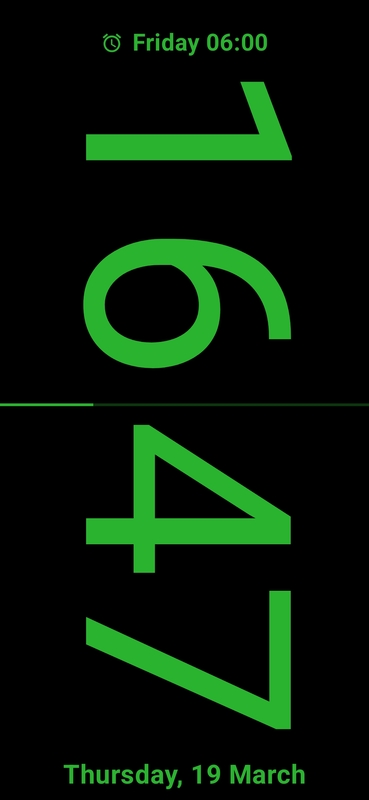
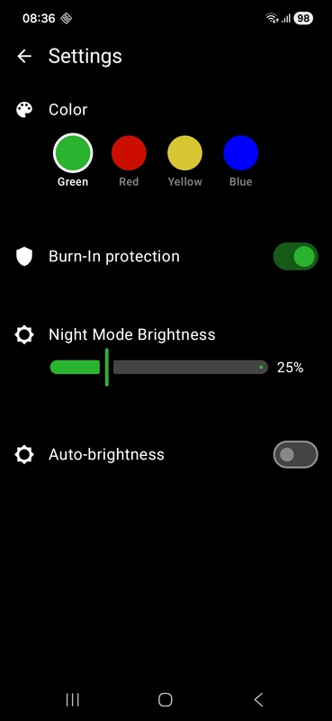

# Night Clock

A fullscreen, minimalist bedside clock for Android — designed for nighttime use with AMOLED-friendly burn-in protection, configurable colors, and automatic Do Not Disturb integration.

## Features

- **Large, Rotated Time Display** — Hours and minutes arranged vertically for easy viewing when your phone is on its side on a nightstand.
- **Sleep Mode** — Long-press the screen to toggle. Reduces brightness and automatically enables Do Not Disturb (alarms only). Restores your previous DND setting when exiting.
- **Configurable Colors** — Choose from four preset colors: Green, Red, Yellow, or Blue.
- **AMOLED Burn-In Protection** — Optional mode that alternates a checkerboard pixel mask to reduce sustained OLED pixel use.
- **Brightness Control** — Adjustable sleep mode brightness slider (0–100%).
- **Auto-Brightness** — Automatically adjusts sleep mode brightness based on the ambient light sensor (when available).
- **Always-On Display** — Screen stays on and the clock shows on the lock screen.
- **Auto-Hiding System UI** — Tap to reveal system bars; they auto-hide after 2 seconds.

## Usage

- **Open Settings** — Tap the screen once to reveal the gear icon in the top-right corner, then tap the gear icon.
- **Toggle Awake/Sleep Mode** — Tap the screen once (gear icon appears), then long-press anywhere on the screen. A toast notification confirms the mode switch.
- **Upcoming Alarm** — The text at the top of the screen automatically displays the time of the next scheduled alarm or alert, if any.

## Screenshots

<p align="center">
  
  
</p>

## Requirements

- Android 15+ (API level 35)
- JDK 21
- Android SDK with API level 36 installed

## Build

```bash
./gradlew assembleDebug
```

## Test

```bash
./gradlew test
```

## Tech Stack

| Component           | Version / Details                    |
|---------------------|--------------------------------------|
| Language            | Kotlin                               |
| UI Framework        | Jetpack Compose (BOM 2024.09.00)    |
| Design System       | Material 3                           |
| Min SDK             | 35 (Android 15)                      |
| Target SDK          | 36                                   |
| Coroutines          | 1.7.3                                |
| Testing             | Robolectric 4.14                     |

## Project Structure

```
app/src/main/java/com/ssxxaazz/nightclock/
├── FullscreenActivity.kt        # Main launcher activity
├── SettingsActivity.kt          # Settings screen
└── ui/
    ├── screen/
    │   ├── FullscreenClock.kt   # Compose clock UI
    │   ├── SettingsScreen.kt    # Compose settings UI
    │   └── SwatchColors.kt      # Color definitions
    └── theme/
        └── Theme.kt             # Dark theme configuration
```

## Configuration

Settings are stored in `SharedPreferences`:

| Preference             | Type    | Default      | Description                          |
|------------------------|---------|--------------|--------------------------------------|
| `text_color`           | String  | `#2AB32F`    | Clock text color (hex)               |
| `burn_in`              | Boolean | `false`      | Enable AMOLED burn-in protection     |
| `sleep_mode_brightness`| Integer | `0`          | Sleep mode brightness (0–100%)       |
| `auto_brightness`      | Boolean | `false`      | Use ambient light sensor for brightness |

## License

This project is licensed under the [GNU General Public License v3.0](LICENSE).
